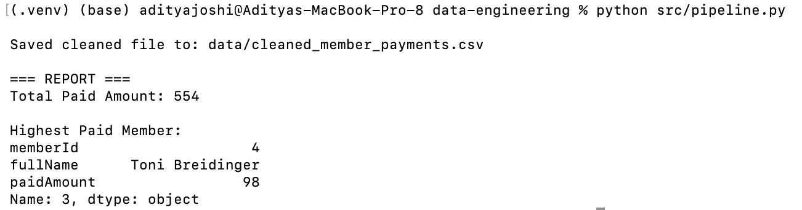

# Assignment D0 – Simple Data Processing Pipeline (ETL)

## Introduction

This project implements a simple ETL (Extract–Transform–Load) pipeline designed to clean and prepare healthcare member payment data for the business intelligence team.
The goal is to ingest raw CSV files, validate the records using strict business rules, standardize names, and output a clean dataset ready for reporting.

## Pipeline Components
- **Extract Layer**: Reads the raw CSV files from the data directory..
- **Transform Layer**: Validates member identity, fixes missing names, resolves name conflicts, and removes invalid rows.
- **Load Layer**: Generates a cleaned flat file.
- **Reporting Layer**: Outputs summary metrics (total paid amount and highest-paying member).

## Dataset Description

Data is located in the `data-engineering/data/` folder:
- `memberInfo.csv`: Official list of members (source of truth)
- `memberPaidInfo.csv`: Raw payment transactions, may contain missing or incorrect names
- `cleaned_member_payments.csv`: Generated output file containing validated, cleaned data

## Requirements

Install dependencies using:

```bash
pip install -r requirements.txt
```

Packages Used:
- pandas

## How to Run the Project

### Step 1 – Navigate to the Project Directory

```bash
cd data-engineering
```

### Step 2 – Create and Activate Virtual Environment

```bash
python3 -m venv .venv
source .venv/bin/activate
```

### Step 3 – Install Dependencies

```bash
pip install -r requirements.txt
```

### Step 4 – Run the ETL Pipeline

```bash
python src/pipeline.py
```

This script performs extraction, validation, transformation, saving of cleaned data, and displays a summary report.

## Key Business Rules

A payment record is considered valid only if:
1. The `memberId` exists in `memberInfo.csv`
2. If `fullName` is present, it must match the correct name (case-insensitive)
3. If `fullName` is missing, it is reconstructed using `firstName + lastName`

Invalid records are excluded from the cleaned dataset.

## Cleaned Output

After running the pipeline, the cleaned dataset is generated at:

`data-engineering/data/cleaned_member_payments.csv`

This dataset includes:
- `memberId`
- `fullName` (validated or reconstructed)
- `paidAmount`

All rows in this file are guaranteed to be valid based on business rules.

## Example Console Output



## Project Structure

```bash
.
├── README.md                   
├── design.md                       
├── .gitignore
└── data-engineering/
    ├── data/
    │   ├── memberInfo.csv
    │   ├── memberPaidInfo.csv
    │   └── cleaned_member_payments.csv
    ├── requirements.txt
    └── src/
        └── pipeline.py           
```

## Expected Outputs

After successful execution:
- `cleaned_member_payments.csv`: Final validated and standardized dataset
- Console report including:
    - Total paid amount
    - Highest-paid member and amount

## Additional Documentation

See `design.md` for:
- Detailed explanation of validation logic
- Transformation steps
- Assumptions and constraints
- Potential improvements for production environments


